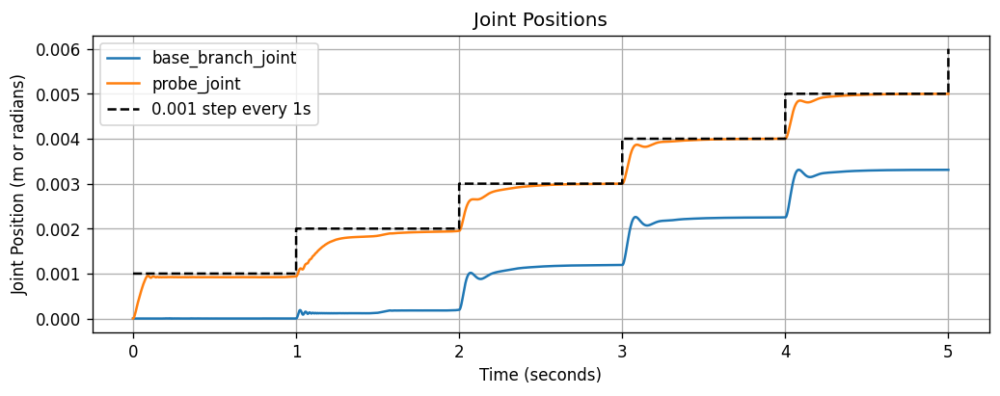
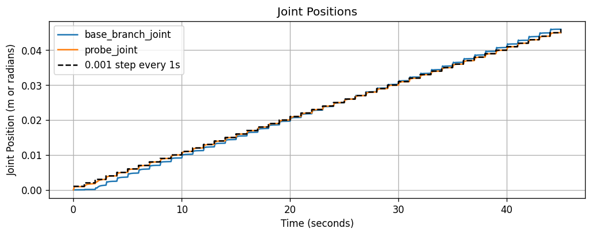
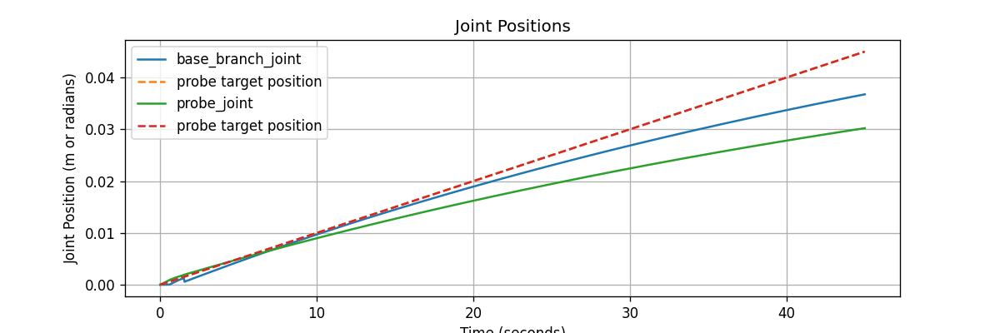
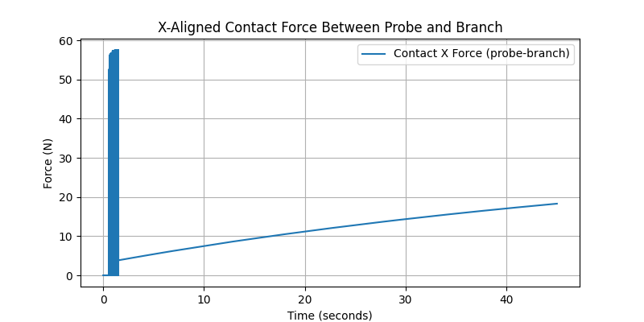
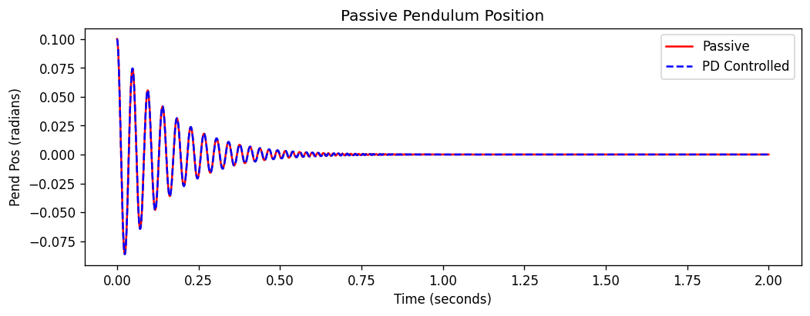

## Helpful Links
| Description | Link |
| ----------- | ---- |
| Everything you can put in an MJDF file | [XML Reference](https://mujoco.readthedocs.io/en/stable/XMLreference.html#) |
| Procedurally adding things to an MJDF file | [Tree MJDF Example](https://colab.research.google.com/github/google-deepmind/mujoco/blob/main/python/mjspec.ipynb#scrollTo=Y4rV2NDh92Ga) |
| Density of a plant branch (0.55 g/cm^3) | [Wood Density and Fiber Dimensions of Populus Ussuriensis](https://bioresources.cnr.ncsu.edu/resources/wood-density-and-fiber-dimensions-of-root-stem-and-branch-wood-of-populus-ussuriensis-kom-trees/#:~:text=The%20root%20wood%20had%20the%20highest%20average%20density%20(0.596%20g,/cm3)%20) |

## Running Log
7/22/25

Submitted to upgrading Ubuntu to 22.04, and of course it broke all the rendering. Spent all day figuring out how to unbreak it. 

Fixes:

1. Launch Ubuntu with Xorg, not wayland. This is done from the Ubuntu log-in screen, from the little gears in the bottom-right corner. This can be checked with the command ```echo $XDG_SESSION_TYPE``` in terminal. It should print ```x11``` if setup properly. 
2. Don't run the script in Anaconda. Make sure it's running in the system Python environment. I've set up ag-venv-py310 to be based on that environment, so it should be good from there. It also didn't like Python 3.9.7 for some reason, so I switched to 3.10.12 and that seems to be working better. Hence, the upgrade and switch from ag-venv. 
3. Run MuJoCo with glfw rendering backend. All environment options (which are now in `single_inv_pend_positionControlled.ipynb`) are:

```
%env MUJOCO_GL=glfw
%env PYOPENGL_PLATFORM=glx
%env LIBGL_ALWAYS_SOFTWARE=0
```

4. `graphicstester.py` is a good script to run to check that all the graphics stuff is installed correctly without the MuJoCo wonkiness. Just run it in terminal; if it doesn't come up with any errors, then we're golden. To set environment variables in terminal, use ```export MUJOCO_GL=glfw``` and similar. 


7/21/25

Out for migraine :(


Updated checklist items from 7/17, with some additions: 

- [x] implement a branch with 2 joints with 0 deg resting positions that's generalizable to n joints. 
- [] Why does the probe look so high?
- [] Make each segment a slightly different color
- [] fix the controller now that the inertia is correct
- [] is the passive stiffness on that joint actually working???
- [] why doesn't it accept cylinders??
- [] Make sure the procedurally generated branch is actually generalizable to more segments. 
- [] make it so that the stiffness of different joints can be changed outside the xml scripts.
- [] implement a branch with 3 joints where at least one joint is NOT 0 degrees. 
- [] figure out how to initiate the probe so that '0' degrees is touching the branch. 
- [] research question to answer: how many joints is the right number of joints? we're just putting a bunch of springs in series, so each spring makes the K value effectively weaker. 

7/18/25

Made a fair bit of progress in programmatically generating canes. The nominal end goal is to be able to set a cane length and number of segments, and for it to segment the branch equally into that many segments and generate the simulation. 

Main takeaways: 
- Joints must be between BODIES, not geometries. 
- New bodies must be defined as children of an existing body, and are defined with respect to that parent body's frame:

```
child_body = parent_body.add_body(name=body_name, pos=[0,0,segment_length])
```
- The mass moment of inertia was wrong for the existing branch URDFs. They were calculated at the base of the rod, not at the center of mass of the rod, so they are at least 4x bigger than they should be. They are now being calculated by the geometry of the branch and the density of 0.55 g/cm3, so it'll change depending on the geometry and be automatically calculated. 

7/17/25

Assuming we're going to move forward with a **position-controlled probe**. 

The next steps are going to be to implement a branch that has more than one joint. Just to brainstorm some next steps here:
- [] implement a branch with 2 joints with 0 deg resting positions that's generalizable to n joints. make sure nothing breaks. 
- [] just to check, change n=3. make sure nothing breaks. 
- [] make it so that the stiffness of different joints can be changed outside the xml scripts.
- [] implement a branch with 3 joints where at least one joint is NOT 0 degrees. 
- [] figure out how to initiate the probe so that '0' degrees is touching the branch. 
- [] research question to answer: how many joints is the right number of joints? we're just putting a bunch of springs in series, so each spring makes the K value effectively weaker. 

Started on implementing the 2 joint branch. I wanted to do it in such a way that it was generalizable and procedurally generated, so I started the work today but didn't finish it. 

7/16/25

The force-only simulations seem to be underestimating the amount of force required to push the canes. However, the velocity simulation and the position simulation produce equally bad results. They predict about 12N of force required over the 0.045rad displacement, whereas it should be around 17.7N, which is about a 32% error. (Cindy was not at all surprised when I brought this up at the Ag meeting.)


7/15/25

Re-removed the probe from the simulation in single_inv_pend_extForce.ipynb. 

Skimming the documentation, there is something called a force sensor: [sensor/force](https://mujoco.readthedocs.io/en/stable/XMLreference.html#sensor-force)

7/10-7/14 

Migraine problems :(

7/9/25

Took out the probe so the branch was directly being pushed on by a force, but then it crashed my computer and all my progress was lost -_-

7/8/25

Implemented a position controlled actuator instead of a velocity controlled actuator. Had to tune a little feedforward + PID controller for it. 



With the contact parameters from the velocity controller, over 5 seconds the plot looked just fine. However, the branch "broke" through the probe at 38 seconds. I knocked the solref down to <0.1 1> and that allowed the system to make it through to 45 seconds: 



At the end of the 45 seconds, we expected a force of 18.09N and measured a force of 18.96N. The final probe position is 45mm, and is only off by 1nm, as opposed to the velocity controller, which had a final probe position of around 33mm after 45s. 

However, this has a PID controller that I spent about an hour tuning. I don't think the velocity controller in MuJoCo has a PID loop on it, just a proportional controller, so it's possible we could put a PID loop on that to make it better. 

7/7/25

Spent the day trying different parameters for solimp and solref in an attempt to minimize the difference between the napkin math and the calculated contact force. Attempts are documented here: [Contact definition experiments](https://docs.google.com/spreadsheets/d/1iFUkzn5xVksr9jLl0r_p5st1Fuz1WwpFBKT4AZi-6Zg/edit?usp=sharing) 

Since the branch is very thin, a very quick transition to stiffness was necessary with the solimp values, but a longer time constant could be used on the spring-damper system for the contact (first value of solref). The best values I achieved for the system, over the 45 second simulation, were a napkin math estimate of 12.9N and a measured simulation contact force of 13.55N. About half a newton of error is honestly better than I thought I was going to achieve with this. 

I did find out that the branch was "phasing through" the crossbar in the earlier experiments, which is what was causing the REALLY drastic oscillations seen in the force plots -- the branch was getting stuck between the crossbar and the pushrod. The force plots are much smoother after taking out the "fork" of the forked probe. A thick "probe" geometry should be used if we ever add the forked geometry back in. 

For posterity, the best values: 

```
solref="0.125 1" solimp=".95 1 0.0025"
```

7/3/25

My #1 suspect for the disparity between the napkin math and the force output is the contact forces/stabilization that MuJoCo has to do behind the scenes. I did mess with `solref` and `solimp`, but neither direction makes the forces any closer to the napkin math outputs. 

So my next idea was to make it a closed loop system -- attach the probe to a wall, effectively, and make a hinge joint connecting the probe to the branch, and push on it. However, this introduces constraint stabilization instead, and if it's not perfectly lined up, introduces its own problems, like huge jumps in force/position at the beginning. I've bashed my head long enough against it in the current state to believe it's not going to work. Here's the next ideas I have: 

- a closed kinematic loop with a joint at the wall, a slider, a joint at the connection, and another joint at the base (4 joints total)
- swapping the velocity controller for a position controller so that it STOPS and we the forces can stabilize
- switching to applying a force trajectory at a point instead of having a second body at all. That way we avoid any weird constraints or contacts or any of that. 

7/2/25

mujoco.mj_contactForce() reports the contact force in the "contact frame", which is a frame defined at the point of contact, not in the world frame. 

When we do some quick napkin math:

```
napkin_math_force = (295*branch_max_disp)/PROBE_HEIGHT
```

and compare it to the actual force we're measuring at the contact point, we get (ignore the negative sign):

```
Final branch displacement: 0.019 rad
Napkin math force: 7.553 N
Final contact x force: -11.287 N
```

6/25/25

Trying to figure out how to get the probe to follow a velocity of 1mm/s, because it really doesn't want to do that. See images/plots for different combinations of dt and kv I've attempted to get there (though I've gitignore'd them because it's clutter). It seems like there's a minimum dt to get the simulation to even register contact between the two objects. Then there's a minimum kv to get the probe to push hard enough on the branch to move it, but also a maximum, else it will just go too fast. So there's this little window where it will push consistently. The best I've found so far is around dt = .00001 and kv=34000. It doesn't follow exactly, but it at least pushes at a consistent pace. We can compare force values when the branch has been displaced by a certain amount, rather than at a specific time, if we need to. 



It has a rather rough force plot as the branch and probe establish contact, but it smooths out over time to a very reasonable line. 



Upon going all the way to 45 seconds (which takes 14 minutes of real time to simulate), it only gets to 30mm. 

6/24/25

MuJoCo has a "position" actuator type that is kind of like a servo motor. My first plan is to run that on the probe and see if we can get it to push on the cane. 

6/23/25

Figured this is as good a place as any to make notes on my progress in MuJoCo for blueberry cane modeling. 

Today I found a link to a joint option called "springdamper": [Springdamper documentation](https://mujoco.readthedocs.io/en/stable/XMLreference.html#body-joint-springdamper), which led to the rest of the documentation for what MJDF files can actually contain. Which is awesome, because apparently MJDF files natively support springs and dampers on joints! Yay! (It's all on the same page. Just scroll.)

I had already implemented a PD controller with Kp = 295 and Kd = 0.15 on a single inverted pendulum. Just to make sure they were doing the same thing, I ran a 2 second simulation with the same initial conditions and plotted the displacement on the same plot. A timestep of 0.00001 was required to get them to overlap completely; a timestep of 0.0001 had them diverging slightly part of the way through. Both sims used the RK4 integrator. 



I think it makes more sense to use the passive components instead of the active ones, especially since it appears that the 3-DOF ball joints are supported. 

MJDFs can be procedurally edited, so I'm going to explore that next. 


